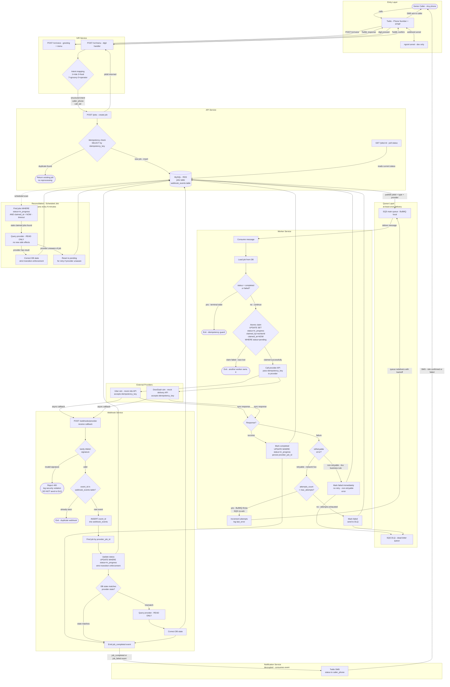

# Concierge Platform

A simplified concierge orchestration platform inspired by GoGoGrandparent.

**Core idea:** Accept a user request via phone → interpret it → dispatch to an external provider → track execution → reconcile final outcome.

## Services

| Service | Port | Responsibility |
|---|---|---|
| api-service | 4000 | Entry point, job creation, idempotency |
| worker-service | — | Queue consumer, provider execution, retries |
| webhook-service | 4001 | Provider callbacks, reconciliation |
| ivr-service | 4002 | Twilio IVR, intent mapping |

## Tech Stack

- **Runtime**: Node.js 20 + TypeScript
- **Framework**: Express
- **ORM**: Prisma 5 + MySQL
- **Queue**: BullMQ (local) / AWS SQS (production)
- **Telephony**: Twilio
- **Infrastructure**: Docker Compose (local) / EC2 + RDS (production)

## High Level Design


## Local Development

### Prerequisites

- Node.js 20
- Docker + Docker Compose
- WSL (Windows) or Linux/Mac

### Setup
```bash
git clone git@github.com:danlewismuriuki/concierge-platform.git
cd concierge-platform
npm install
cp .env.example .env
# Edit .env with your values
docker-compose up -d
cd shared/db && npx prisma migrate dev && cd ../..
npm run dev:api
```

### Environment Variables

Copy `.env.example` to `.env`. Twilio and AWS keys are only needed for IVR and production deployment.

| Variable | Required now | Used for |
|---|---|---|
| DATABASE_URL | yes | Prisma + MySQL |
| PORT | yes | API service port |
| REDIS_HOST / REDIS_PORT | next step | BullMQ queue |
| WORKER_ID / MAX_JOB_ATTEMPTS | next step | Worker service |
| TWILIO_* | IVR step | Phone calls |
| AWS_* | production only | SQS + EC2 |

## Architecture Decisions

- **Idempotency at three layers** — API (idempotency_key), worker (state guard), DB (atomic UPDATE WHERE status=pending)
- **At-least-once delivery** — SQS/BullMQ delivers at least once so all consumers are idempotent by design
- **Error classification** — retryable (network, 5xx) vs non-retryable (4xx, validation) before incrementing attempts
- **Reconciliation** — scheduled job corrects DB state for stale jobs where webhooks were lost
- **Webhook deduplication** — event_id stored in webhook_events table survives restarts
- **Atomic worker claim** — UPDATE WHERE status=pending with claimed_by + claimed_at prevents race conditions
